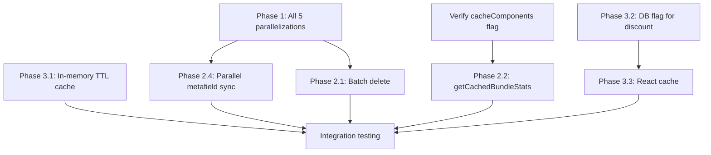

# Artiforge Analysis Plan — Server Action Optimization Audit

> Generated: 2026-02-22 | Tool: Artiforge MCP (codebase-scanner + task-plan)

---

## Plan Overview

8-step deep analysis of the SERVER-ACTION-OPTIMIZATION-PLAN covering static analysis, architectural validation, risk assessment, and implementation roadmap.

---

## Step 1: Collect Source Files (Baseline)

**Action**: Read all 11 critical files for exact baseline analysis.

**Files**:

- `web/features/bundles/actions/bundle-mutations.action.ts`
- `web/features/bundles/repositories/bundle.queries.ts`
- `web/features/settings/actions/settings.action.ts`
- `web/features/analytics/actions/analytics.action.ts`
- `web/features/analytics/services/analytics.cached.ts`
- `web/lib/graphql/operations/metafield.operations.ts`
- `web/lib/graphql/client/server-action.ts`
- `web/lib/shopify/setup/ensure-setup.ts`
- `web/lib/cache/*.ts`
- `web/shared/repositories/*`
- `web/prisma/schema.prisma`

---

## Step 2: Static Analysis — Code Smells & Patterns

**Action**: Detect N+1 queries, missing error handling, rate-limit-unsafe patterns.

**Detection targets**:

- Direct `await` inside loops → should be `Promise.all`
- `findMany` without `take`/`skip` pagination
- GraphQL mutations without retry/backoff
- `new Map()` caching without TTL handling
- Missing `try/catch` or `Promise.allSettled`

**Output**: Markdown report with detected issues per file.

---

## Step 3: Validate Each Phase Item

**Action**: Matrix validation of all 12 optimization items against code rules.

**Matrix columns**:
| Item | Description | Rate-limit Impact | Error Handling | Cache Compatibility | Rule Compliance |
|------|-------------|-------------------|----------------|---------------------|-----------------|

**Calculations**:

- Phase 1.1: ensureMetafieldDefinition (~5pts) + ensureBundleDiscount (~10pts) = 15pts/s → SAFE
- Phase 1.5: 4 × ProductUpdate (~10pts) = 40pts/s → SAFE but tight
- Phase 2.1: batched ProductDelete groups of 4 = 40pts/s → SAFE

**Critical check**: Verify `cacheComponents: true` in `next.config.ts`

---

## Step 4: Additional Code Smells & Risks (Beyond MCP Audit)

**Action**: Identify issues NOT caught by previous MCP audit.

**Check for**:

- String interpolation in GraphQL queries (injection risk)
- Unparameterized Prisma raw SQL calls
- Missing `await` on async DB calls (fire-and-forget bugs)
- Global mutable state without concurrency guard
- Hard-coded magic numbers not defined as constants
- Missing type-guards on API response casting
- Dead-lock potential in concurrent setup calls
- Missing barrel exports violating feature-module rule

---

## Step 5: Rate-Limit Utility Design

**Action**: Design centralized concurrency control utility.

**Proposed file**: `web/lib/shopify/rateLimiter.ts`

```typescript
export async function executeWithRateLimit<T>(
    tasks: (() => Promise<T>)[],
    opts?: { maxPointsPerSec?: number; batchSize?: number },
): Promise<T[]>;
```

**Features**:

- Token bucket algorithm (50pts/s, 1000-point burst)
- Exponential backoff: 200ms → 400ms → 800ms (max 3 retries)
- Throttle event logging with shopId context
- Custom `ShopifyRateLimitError` on unrecoverable failures
- Typed wrapper: `runMutations(tasks)` auto-groups by cost

---

## Step 6: Cache Refactoring

**Action**: Evaluate cache implementations for serverless compatibility.

**Option A (plan's proposal)**: In-memory Map with 5-min TTL

- Pro: Zero overhead, sub-ms reads
- Con: Resets on cold start
- Verdict: Acceptable for warm instances, document the limitation

**Option B (Artiforge suggestion)**: DB-backed cache table

- New Prisma model: `CacheEntry { key, value Json, expiresAt DateTime }`
- Pro: Persists across cold starts
- Con: ~5ms read overhead (vs 0ms in-memory), adds DB load
- Verdict: Over-engineered for stable values like shopId/discountId

**Recommendation**: Keep in-memory TTL (Phase 3.1) as-is. The values are stable (change on app reinstall only) and Neon has 0s suspend timeout (always-on). Cold start penalty is just one extra API call (~200ms) which only happens once per instance lifecycle.

**cacheComponents flag**: MUST verify `next.config.ts` has `cacheComponents: true` before Phase 2.2.

---

## Step 7: Prioritized Implementation Roadmap

**Dependency flow**:



**Roadmap table**:

| ID  | Description                           | Phase       | Effort | Impact                | Risk   | Dependencies      | Week |
| --- | ------------------------------------- | ----------- | ------ | --------------------- | ------ | ----------------- | ---- |
| R1  | Verify cacheComponents flag           | Pre-req     | 1      | Blocking              | Low    | None              | W1   |
| R2  | Phase 1: All 5 parallelizations       | Quick Win   | 3      | 40% latency reduction | Low    | None              | W1   |
| R3  | Phase 2.2: getCachedBundleStats       | Medium      | 1      | Dashboard perf        | Low    | R1                | W1   |
| R4  | Phase 2.1: Batch delete N+1           | Medium      | 3      | 75% delete latency    | Medium | None              | W2   |
| R5  | Phase 2.4: Parallel metafield sync    | Medium      | 2      | 300-600ms savings     | Low    | None              | W2   |
| R6  | Phase 3.2: DB flag for discount       | Large       | 2      | 200-300ms/call        | Low    | Schema push       | W2   |
| R7  | Phase 3.1: In-memory TTL cache        | Large       | 2      | 400ms/call            | Low    | None              | W3   |
| R8  | Phase 3.3: React cache() dedup        | Large       | 2      | Request dedup         | Low    | R1                | W3   |
| R9  | Remove useless BundleSettings indexes | DB          | 1      | Write perf            | Low    | None              | W3   |
| R10 | Add rate-limit retry utility          | Enhancement | 3      | Reliability           | Medium | None              | W3   |
| —   | Phase 2.3: take:200                   | SKIP        | —      | —                     | HIGH   | Pagination design | —    |

---

## Step 8: Documentation Updates

**Action**: Update project docs with new patterns.

**Additions needed**:

- Rate-limit management guidelines
- Caching strategy (in-memory TTL + "use cache" + cacheTag)
- Promise.all vs Promise.allSettled decision matrix
- Mermaid data flow diagram: Server Action → Rate Limiter → GraphQL → Cache

---

## Artiforge Additional Findings (Beyond MCP Audit)

### New Issues Identified

1. **Hard-coded batch size of 4** — Should be a configurable constant (`SHOPIFY_MUTATION_BATCH_SIZE = 4`) in `web/shared/constants/`

2. **Console.error in catch blocks without structured logging** — All server actions use `console.error("[actionName] Error:", error)`. Should use a structured logger with shop context for production observability.

3. **Missing type-guard on GraphQL mutation results** — `executeGraphQLMutation` returns typed results but callers don't validate `data` is non-null before accessing nested properties (e.g., `result.bundle!.id` uses non-null assertion).

4. **Fire-and-forget risk in metafield syncs** — When metafield sync fails, it's logged as a warning but the main response still returns "success". This is intentional but should be documented as an accepted trade-off.

5. **Global mutable state in proposed TTL cache** — `const ID_CACHE = new Map()` is module-level mutable state. In serverless with concurrent requests, this is fine for reads but could have race conditions during cache invalidation. Use a mutex or accept eventual consistency.

6. **Missing `compareDigest` for concurrent metafield writes** — Phase 1.2/1.3 parallelize metafield writes to the same shop. If two server actions run simultaneously (two browser tabs), they could overwrite each other's shop metafields. `compareDigest` (Shopify API 2024-07+) prevents this.

7. **`revalidatePath` called multiple times redundantly** — `createBundleAction` calls `revalidatePath("/bundles")`, `revalidatePath("/dashboard")`, AND `invalidateDashboardCache(shop)`. The last one likely already handles dashboard invalidation — potential duplication.

8. **200ms rate-limiting sleep in ensureMetafieldDefinition** — Line 96 has `await new Promise(resolve => setTimeout(resolve, 200))` inside the definition creation loop. This is only hit on first setup but adds unnecessary latency when creating 5+ definitions. Should use the batch rate-limiter utility instead.
